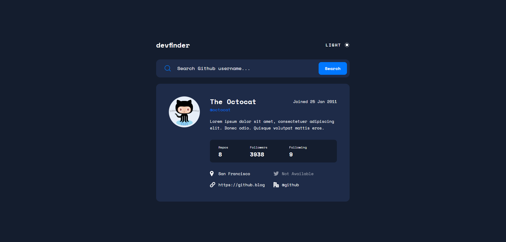
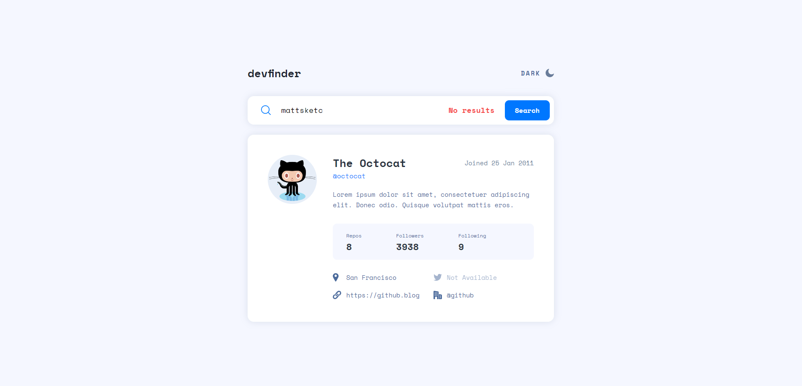
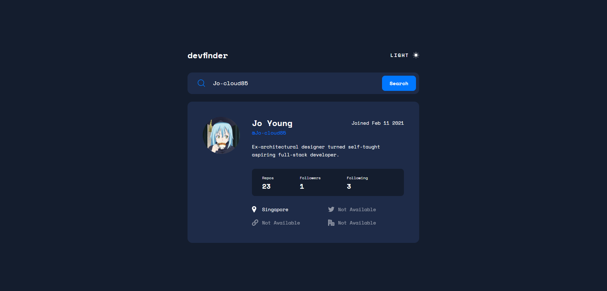

# Frontend Mentor - GitHub user search app solution

This is a solution to the [GitHub user search app challenge on Frontend Mentor](https://www.frontendmentor.io/challenges/github-user-search-app-Q09YOgaH6). Frontend Mentor challenges help you improve your coding skills by building realistic projects.

## Table of contents

- [Overview](#overview)
  - [The challenge](#the-challenge)
  - [Expected behaviour](#expected-behaviour)
  - [Screenshot](#screenshot)
  - [Links](#links)
- [My process](#my-process)
  - [Built with](#built-with)
  - [What I learned](#what-i-learned)
  - [Continued development](#continued-development)
  - [Useful resources](#useful-resources)
- [Author](#author)

## Overview

### The challenge

Users should be able to:

- View the optimal layout for the app depending on their device's screen size
- See hover states for all interactive elements on the page
- Search for GitHub users by their username
- See relevant user information based on their search
- Switch between light and dark themes
- **Bonus**: Have the correct color scheme chosen for them based on their computer preferences. _Hint_: Research `prefers-color-scheme` in CSS.

### Expected behaviour

- On first load, show the profile information for Octocat.
- Display an error message (as shown in the design) if no user is found when a new search is made.
- If a GitHub user hasn't added their name, show their username where the name would be without the `@` symbol and again below with the `@` symbol.
- If a GitHub user's bio is empty, show the text "This profile has no bio" with transparency added (as shown in the design). The lorem ipsum text in the designs shows how the bio should look when it is present.
- If any of the location, website, twitter, or company properties are empty, show the text "Not Available" with transparency added (as shown in the design).
- Website, twitter, and company information should all be links to those resaources. For the company link, it should remove the `@` symbol and link to the company page on GitHub. For Octocat, with `@github` being returned for the company, this would lead to a URL of `https://github.com/github`.

### Screenshot

- Main-dark: 
- Main-light w error: 
- Profile-search: 

### Links

- Solution URL: [Add solution URL here](https://your-solution-url.com)
- Live Site URL: [Add live site URL here](https://your-live-site-url.com)

## My process

### Built with

- Semantic HTML5 markup
- CSS custom properties
- Flexbox
- CSS Grid
- Mobile-first workflow
- [jQuery](https://reactjs.org/) - JS library
- [Styled Components](https://styled-components.com/) - For styles

### What I learned

This is my first attempt at a mobile-first workflow. It seems friendlier compared to desktop-first workflow where I would sometimes face issues with media queries.

Overall, this is definitely more challenging than the advice API generator. There are multiple error checks to manage such as bio description and other details like website, twitter profile and company. I learnt how to use a handler function to run through the data and set the respective output accordingly.

```
function handleDetail(detail, content, value, href) {
  if (!value) {
    content.text("Not Available");
    detail.addClass('disable-link');
  } else {
    content.text(value);
    if (href) {
      content.attr('href', href);
    }
    detail.removeClass('disable-link');
  }
}

const detailHandlers = {
  location: (detail, content) => handleDetail(detail, content, data.location),
  website: (detail, content) => handleDetail(detail, content, data.blog, data.blog),
  twitter: (detail, content) => handleDetail(detail, content, data.twitter_username, `https://twitter.com/${data.twitter_username}`),
  company: (detail, content) => handleDetail(detail, content, data.company, `https://github.com/${data.login}`)
};

otherDetails.find('div').each(function() {
  const detail = $(this);
  const content = detail.find('p, a');
  const handler = detailHandlers[content.attr('id')];
  if (handler) {
    handler(detail, content);
  }
});
```

Secondly, I also had a little revision of the date formatting because of the desired output on the rendered page.

```
const dateFormatted = dateObj.toLocaleDateString('en-US', {day: '2-digit', month: 'short', year: 'numeric'}).replace(',', '');
```

Lastly, for the CSS side, I learnt about prefers-color-scheme in this challenge. I am not sure whether I have done it right but it sure is something new for me.

### Continued development

To develop this app to run on the server side using express.js instead of client side.

### Useful resources

- [jQuery API Documentation](https://api.jquery.com/ready/) - I realised some of the functions that I used for the past challenges have been deprecated so re-reading the documents helped me to correct some of my syntax to the latest versions.

## Author

- Frontend Mentor - [@Jo-cloud85](https://www.frontendmentor.io/profile/Jo-cloud85)
